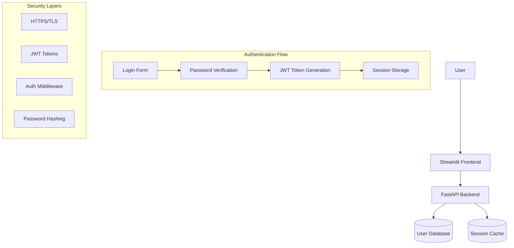

# Streamlit + FastAPI Authentication System Architecture

## System Overview

## Core Components

### 1. User Storage & Models
- **User Database Schema**
- **Password Hashing Strategy**
- **User Roles & Permissions**

### 2. Authentication Layer
- **Credential Verification**
- **Token Generation & Validation**
- **Session Management**

### 3. API Protection
- **Route Protection Middleware**
- **Token-based Authorization**
- **Request Validation**

### 4. Security Features
- **Data Encryption (Transit & Rest)**
- **CSRF Protection**
- **Rate Limiting**
- **Secure Headers**

## Key Security Decisions to Make

Before we implement anything, let's think through these architectural questions:

1. **Token Strategy**: JWT vs Session-based auth?
2. **Password Security**: Argon2 vs BCrypt vs SCrypt?
3. **Data Encryption**: What data needs encryption at rest?
4. **Session Management**: Where to store tokens/sessions?
5. **API Communication**: How should Streamlit authenticate with FastAPI?

## Next Steps

We'll implement each component while understanding:
- The security rationale behind each choice
- How components interact
- Common vulnerabilities to avoid
- Best practices for production deployment